# Week 1 "Passwords" — Dependency Diagram & Redesign Impact Map

> Read-only analysis built on the Week 1 architecture audit. No code was changed.
> Scope: the **Cyber Heroes** Passwords lesson at `/lesson/1` (not the unrelated
> `/cyberexplorers/week1` "Digital Identity" lesson).
>
> **Reuse fact that drives the classification:** Weeks 2–6 reuse
> `cyberScanner, protectTheData, chooseYourPath, memoryMatch, cyberMaze,
> firewallBuilder, spamBlaster`. The password-themed exercises
> (`passwordVault, passwordHospital, weakSorter, threeRandomWords,
> accountRescue, popupPanic, phishInspector, passwordLab`) appear in **no**
> other week — they are Week-1 exclusive.

---

## 1. Dependency diagram

```mermaid
graph TD

  %% ─────────────── ROUTING ───────────────
  subgraph ROUTING["🧭 Routing"]
    PAGE["app/lesson/&#91;week&#93;/page.tsx<br/><i>server auth + entitlement gate</i>"]
    AUTH["auth() + hasEntitlement()<br/><i>app/lib/auth · entitlements</i>"]
  end

  %% ─────────────── ORCHESTRATION ───────────────
  subgraph ORCH["🎛️ Orchestration (shared by all weeks)"]
    DL["DynamicLesson.tsx<br/><i>renderScreen() switch · nav · BGM</i>"]
    CHROME["Lesson chrome<br/>LessonHUD · LessonArena3D · LessonAmbience<br/>ScreenTransition · ScreenShake · StoryCutscene<br/>RiveCharacterGuide · ExerciseErrorBoundary"]
    INFO["InfoNarration.tsx<br/><i>info-screen narration</i>"]
  end

  %% ─────────────── CONTENT / DATA ───────────────
  subgraph CONTENT["📦 Content / Data"]
    IDX["weekContent/index.ts<br/><i>getWeekContent() registry</i>"]
    W1["week1.ts<br/><b>23-screen data + boss + reactions</b>"]
    TY["types.ts<br/><i>ScreenDef union (schema)</i>"]
  end

  %% ─────────────── EXERCISES: WEEK-1 EXCLUSIVE ───────────────
  subgraph EXW1["🟢 Exercises — Week-1 exclusive"]
    PV["PasswordVault"]
    PH["PasswordHospital"]
    WS["WeakSorter"]
    TRW["ThreeRandomWords"]
    AR["AccountRescue"]
    PP["PopupPanic"]
    PI["PhishInspector"]
    PL["PasswordLab<br/><i>(hardcoded content)</i>"]
    MD["MissionDebrief"]
    SU["StickerUnlock"]
  end

  %% ─────────────── EXERCISES: SHARED W2+ ───────────────
  subgraph EXSH["🟡 Exercises — shared with Weeks 2–6"]
    CS["CyberScanner"]
    PTD["ProtectTheData"]
    MM["MemoryMatch"]
    CYP["ChooseYourPath"]
    CM["CyberMaze"]
    FB["FirewallBuilder"]
    SB["SpamBlaster"]
    BOSS["BossBattle<br/><i>(game/, all weeks)</i>"]
  end

  %% ─────────────── SHARED TOOLKIT ───────────────
  subgraph TOOLKIT["🟠 Shared Exercise Toolkit (reused everywhere)"]
    EF["ExerciseFrame"]
    UEF["useExerciseFeedback"]
    UGA["useGameAudio"]
    UMI["useMotionIntensity"]
    CEL["celebrations.ts"]
    ST["ScoreToast"]
    SUP["WrongAnswerPanel · HintBubble · GameButton · LessonStage"]
  end

  %% ─────────────── PLATFORM ───────────────
  subgraph PLAT["🔴 Platform infrastructure"]
    ULP["useLessonProgress"]
    LPA["lessonProgress.actions → Prisma"]
    PROG["progression.ts (XP/rank)"]
    ANA["analytics.ts"]
    STK["stickers.actions"]
    SND["sounds.ts"]
    GEA["gameEngine/audio.ts"]
    CMF["comfortMode"]
  end

  %% ─────────────── ASSETS / TOKENS ───────────────
  subgraph ASSETS["🎨 Assets & Styling Sources"]
    VID["/videos/module-01-intro.mp4"]
    VOICE["/audio/voice/manifest.json + MP3s<br/><i>ElevenLabs narration</i>"]
    SFX["/audio/sfx-signature/manifest.json"]
    TOK["cyberTokens.ts + inline hex literals"]
  end

  %% ─────────────── EDGES ───────────────
  PAGE --> AUTH
  PAGE --> DL

  DL --> IDX --> W1 --> TY
  DL --> CHROME
  DL --> INFO
  DL --> ULP --> LPA
  DL --> PROG
  DL --> ANA
  DL --> STK
  DL --> CEL
  DL --> UGA

  %% orchestrator mounts exercises
  DL --> PV & PH & WS & TRW & AR & PP & PI & PL & MD & SU
  DL --> CS & PTD & MM & CYP & CM & FB & SB & BOSS

  %% exercises → toolkit
  PV --> EF
  PH --> EF
  WS --> EF
  TRW --> EF
  AR --> EF
  PP --> EF
  PI --> EF
  CS --> EF
  MM --> EF
  CYP --> EF
  CM --> EF
  SB --> EF
  PV --> UEF
  PH --> UEF
  TRW --> UEF
  AR --> UEF
  PP --> UEF
  PI --> UEF

  %% legacy bypass (raw audio + celebrations, no fx hook)
  WS -. legacy .-> CEL
  CS -. legacy .-> CEL
  PTD -. legacy .-> CEL

  %% toolkit internals
  UEF --> UGA
  UEF --> UMI
  UEF --> ST
  UMI --> CMF
  UGA --> SND
  UGA --> GEA
  UGA --> SFX
  CEL --> SND

  %% narration + assets
  INFO --> VOICE
  DL --> VID

  %% styling (loose / inline)
  EF -. tokens .-> TOK
  DL -. inline hex .-> TOK

  %% ─────────────── STYLING ───────────────
  classDef week1 fill:#1f6f3f,stroke:#5eff97,color:#eafff0,stroke-width:1px;
  classDef shared fill:#7a5a10,stroke:#fbbf24,color:#fff6df,stroke-width:1px;
  classDef toolkit fill:#7a3d10,stroke:#ff8c42,color:#fff0e6,stroke-width:3px;
  classDef platform fill:#6e1f25,stroke:#ff6b6b,color:#ffe9e9,stroke-width:1px;
  classDef content fill:#1d3a66,stroke:#60a5fa,color:#e7f0ff,stroke-width:1px;
  classDef asset fill:#3a3550,stroke:#a08fff,color:#efeaff,stroke-width:1px;
  classDef route fill:#14323a,stroke:#22d3ee,color:#e3fbff,stroke-width:1px;

  class PAGE,AUTH route;
  class DL,CHROME,INFO content;
  class IDX,W1,TY content;
  class PV,PH,WS,TRW,AR,PP,PI,PL,MD,SU week1;
  class CS,PTD,MM,CYP,CM,FB,SB,BOSS shared;
  class EF,UEF,UGA,UMI,CEL,ST,SUP toolkit;
  class ULP,LPA,PROG,ANA,STK,SND,GEA,CMF platform;
  class VID,VOICE,SFX,TOK asset;
```

**Legend** — 🟠 thick-bordered orange = **shared toolkit (reused by every exercise in every week)**; 🟢 green = Week-1-only exercises; 🟡 amber = exercises shared with W2–6; 🔴 red = platform infra; 🔵 blue = orchestration + content; 🟣 violet = assets/tokens. Dashed `legacy` edges mark exercises that bypass `useExerciseFeedback` and call `celebrations.ts` / raw audio directly.

---

## 2. Redesign impact map

| File | Bucket | Reason |
|---|---|---|
| `app/lesson/weekContent/week1.ts` | 🟢 Safe to rewrite | The Week-1 data object; nothing else imports it. |
| `app/components/exercises/PasswordVault.tsx` | 🟢 Safe to rewrite | Used only by Week 1 (`passwordVault` absent from W2–6). |
| `app/components/exercises/PasswordHospital.tsx` | 🟢 Safe to rewrite | Week-1 exclusive (`passwordHospital` not in any other week). |
| `app/components/exercises/WeakSorter.tsx` | 🟢 Safe to rewrite | Week-1 exclusive; also a legacy-juice candidate to fix. |
| `app/components/exercises/ThreeRandomWords.tsx` | 🟢 Safe to rewrite | Week-1 exclusive. |
| `app/components/exercises/AccountRescue.tsx` | 🟢 Safe to rewrite | Week-1 exclusive. |
| `app/components/exercises/PopupPanic.tsx` | 🟢 Safe to rewrite | Week-1 exclusive. |
| `app/components/exercises/PhishInspector.tsx` | 🟢 Safe to rewrite | Week-1 exclusive. |
| `app/components/exercises/PasswordLab.tsx` | 🟢 Safe to rewrite | Week-1 exclusive; content is hardcoded inside it. |
| `app/components/lesson/MissionDebrief.tsx` | 🟢 Safe to rewrite* | Only Week 1 currently mounts it (*generic by design — confirm before reuse). |
| `app/components/lesson/StickerUnlock.tsx` | 🟢 Safe to rewrite* | Only Week 1 currently mounts it (*reward-loop component, conceptually reusable). |
| `/public/videos/module-01-intro.mp4` | 🟢 Safe to rewrite | Week-1 intro asset, referenced only by `week1.ts`. |
| `app/components/exercises/CyberScanner.tsx` | 🟡 Edit with caution | Reused by W3–6; also a legacy-juice path. Fork if changing mechanics. |
| `app/components/exercises/ProtectTheData.tsx` | 🟡 Edit with caution | Reused by W2–6; bypasses the toolkit entirely. |
| `app/components/exercises/MemoryMatch.tsx` | 🟡 Edit with caution | Reused by W3–6 (different `pairs` data). |
| `app/components/exercises/ChooseYourPath.tsx` | 🟡 Edit with caution | Reused by W2–6. |
| `app/components/exercises/CyberMaze.tsx` | 🟡 Edit with caution | Reused by W2–6. |
| `app/components/exercises/FirewallBuilder.tsx` | 🟡 Edit with caution | Reused by W3–6. |
| `app/components/exercises/SpamBlaster.tsx` | 🟡 Edit with caution | Reused by W3–6. |
| `app/components/game/BossBattle.tsx` | 🟡 Edit with caution | Single boss engine for every week; data-driven by each `bossPhases`. |
| `app/components/lesson/ExerciseFrame.tsx` | 🟡 Edit with caution | Shared chrome wrapping nearly every exercise in every week. |
| `app/lib/gameEngine/useExerciseFeedback.tsx` | 🟡 Edit with caution | The cross-exercise juice contract; changes ripple everywhere. |
| `app/lib/gameEngine/useGameAudio.ts` | 🟡 Edit with caution | Typed audio facade used by all exercises + boss. |
| `app/lib/gameEngine/useMotionIntensity.ts` | 🟡 Edit with caution | Accessibility gate consumed across the toolkit. |
| `app/lib/celebrations.ts` | 🟡 Edit with caution | Global confetti/shake helpers fired by many surfaces. |
| `app/components/lesson/ScoreToast.tsx` | 🟡 Edit with caution | Toast renderer used by `useExerciseFeedback`. |
| `WrongAnswerPanel · HintBubble · GameButton · LessonStage` | 🟡 Edit with caution | Shared exercise sub-components used by all weeks. |
| `app/components/lesson/InfoNarration.tsx` | 🟡 Edit with caution | Shared narration block used by every week's info screens. |
| `app/lesson/weekContent/types.ts` | 🟡 Edit with caution | Shared `ScreenDef` schema; **additive** variants are safe, edits to existing ones ripple. |
| `app/lesson/weekContent/index.ts` | 🟡 Edit with caution | Week registry; touched only to register types/weeks. |
| `app/lesson/[week]/DynamicLesson.tsx` | 🟡 Edit with caution | One orchestrator for all weeks; **adding a `case` is safe**, structural edits ripple. |
| `app/components/scene/cyberTokens.ts` | 🟡 Edit with caution | Shared palette/token source for the toolkit and all lessons. |
| `app/lesson/[week]/page.tsx` | 🔴 Do not touch | Auth + entitlement routing gate. |
| `app/lib/auth.ts` · `entitlements` | 🔴 Do not touch | Platform auth/access control. |
| `app/lib/useLessonProgress.ts` | 🔴 Do not touch | Progress/attempt model used by every lesson. |
| `app/lib/lessonProgress.actions.ts` (→ Prisma) | 🔴 Do not touch | Persistence schema + server actions. |
| `app/lib/progression.ts` | 🔴 Do not touch | XP/rank engine, app-wide. |
| `app/lib/analytics.ts` | 🔴 Do not touch | Event taxonomy feeding the parent dashboard. |
| `app/lib/stickers.actions.ts` | 🔴 Do not touch | Reward persistence (EarnedSticker). |
| `app/lib/sounds.ts` · `gameEngine/audio.ts` | 🔴 Do not touch | Low-level audio infrastructure. |
| `app/lib/comfortMode.tsx` | 🔴 Do not touch | Accessibility provider, app-wide. |
| `/audio/voice/manifest.json` · `/audio/sfx-signature/manifest.json` | 🔴 Do not touch | Shared audio manifests/pipelines (add Week-1 entries additively, don't restructure). |

---

## 3. Summary verdict

**The cleanest seam is the exercise-component boundary for the eight password-themed exercises plus their data in `week1.ts`.** Because `passwordVault / passwordHospital / weakSorter / threeRandomWords / accountRescue / popupPanic / phishInspector / passwordLab` are imported by nothing outside Week 1, you can rewrite them — and their content — entirely within the 🟢 set without touching another week. The orchestrator (`DynamicLesson`) and schema (`types.ts`) only need **additive** edits (new `case` + new `ScreenDef` variant), which don't disturb existing weeks.

**Recommendation: fork new Week-1-specific components rather than modify shared ones.** Keep the shared toolkit (`ExerciseFrame`, `useExerciseFeedback`, `useGameAudio`, `useMotionIntensity`, `celebrations`) as a *consumed dependency*, not an edit target — its value is the cross-week consistency and the built-in accessibility gates (motion intensity, comfort mode, reduced-motion), and changing it ripples into W2–6 and the boss. If a redesign needs richer juice, **add new opt-in methods to the toolkit** (backward-compatible) instead of altering existing ones. The only shared exercises worth touching are the two legacy-juice outliers (`CyberScanner`, `ProtectTheData`); since they're reused by later weeks, fork Week-1 variants there too rather than rewriting them in place. Net: a full Week-1 exercise redesign is achievable as a 🟢-only effort plus additive 🟡 hooks — zero 🔴 changes required.
